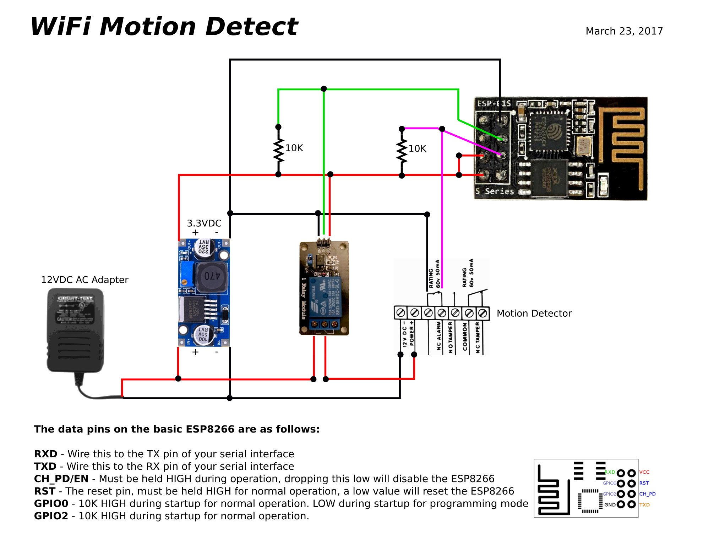

# Control remoto de Caldera

El sistema permite controlar remotamente el encendido de una Caldera de Calefación
Consta de 2 partes:

* Un NodeMCU (ESP8266 con ESP12E) para controlar la caldera directamente y accesible por Wifi
* Una aplicación Android permite acceder remotamente.

### montaje con ESP8266

## Fase 1

### Sensores

* Sensor de humos  MQ2 en el analógico A0
* Sensores de temperatura:
  * DS18x20 en tubo 1 de salida del agua caliente
  * DS18x20 en tubo 2 de salida del agua caliente
  * varios DS18x20 en el interior de la caldera
* DHT22 junto a la caldera para medir temperatura y humedad

### Actuadores

* Relé de encendido de la caldera

### Acceso remoto

* Podemos activar el relé de la caldera remotamente
* Vemos los valores de los distintos sensores
* Disponemos de un api REST para poder activar el relé de la caldera
* Aplicación Android para activar/desactivar
* Iconos con HTTP Widget para activar/deactivar ver estado

## Fase 2

### Sensores

* Sensor de luz para los leds de la caldera
* La centralita mide la temperatura en el interior de la vivienda

### Acceso remoto

* La centralita usa el api REST para activar/desactivar el relé en función de los datos de temperatura de los sensores
* Seguridad de Acceso
* Descubrimiento de elementos del sistema (existe una URL específica que identifica cada dispositivo)

### Actuadores

* Relé para activar ventilador de humos

### Fase 3

### Sensores

* Sensores de temperatura distribuidos por la casa reportan datos a la centralita

### Acceso remoto

* Acceso desde internet
